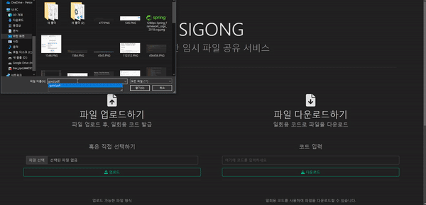
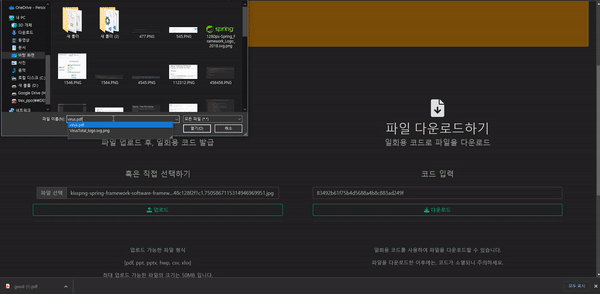

# Sigong - Tmp File sharing

2022 자람 하계 워크샵 대체 과제로 개발한 토이 프로젝트입니다.

[API Docs](https://hrabit64.github.io/sigong/)

### 사용한 기술
Spring Boot

Redis

Bootstrap

Thymeleaf

### 프로젝트 설명

#### 주요 기능
사용자가 서비스에 파일을 업로드 하면, 일정시간 동안 유지되는 일회용 코드를 발급 해줍니다.

사용자는 해당 코드를 통해 파일을 다운로드 받을 수 있습니다.

#### 바이러스 스캔

파일 업로드 시, 파일의 명칭과 확장자명을 변경하고, virustotal의 Open API를 통해 안전한 파일인지 검증합니다.

### 잔여 파일 삭제

스케줄러를 사용하여 주기적으로 Code가 말소된 잔여 파일들을 주기적으로 삭제합니다.